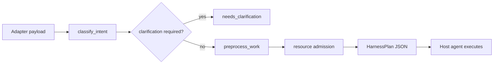

# Architecture

## 개요

`clx-preprocessing`은 두 Python 패키지와 선택적 Rust 바이너리로 구성됩니다.

| 구성요소 | 역할 |
|----------|------|
| `cluxion_agentplugin_preprocessing` | 플러그인 등록, CLI (`cluxion-preprocess`), Hermes config helper |
| `cluxion_runtime` | `cluxion-runtime` CLI, harness 엔진 |
| `rust/cluxion_queue` | `cluxion-queue` — durable queue + dispatch store |

## Host Agent vs Cluxion

**Host agent (Hermes / Claude / Codex / Grok)**

- OAuth 및 provider 인증
- 활성 모델 선택
- 도구 권한 및 최종 대화 상태
- 실제 LLM completion 호출

**Cluxion preprocessing**

- `WorkItem` 정규화
- 의도·방향 분류 (`classify_intent`)
- 전처리 모드 결정 (`preprocess_work`)
- 명확화 필요 여부 (`assess_clarification`)
- `answer_policy` · `host_execution` 계약 생성
- (queued) segment를 out-of-band store에 저장
- 리소스 admission (`collect_resource_snapshot`)

## 처리 흐름

## Preprocessing modes

| Mode | 용도 |
|------|------|
| `simple_answer` | 짧은 일반 질문, fast path |
| `verification_answer` | 사실 확인이 필요한 짧은 질문 |
| `standard` | 코드·테스트·보안·문서 등 실질 작업 |
| `queued` | 긴 입력, segment 분할 |
| `needs_clarification` | 사용자 방향 확정 전, 큐 진입 차단 |

## Queue 백엔드

- **Rust** (`cluxion-queue`): WAL SQLite + atomic JSON dispatch
- **Python**: 동일 API의 파일 기반 fallback
- 테스트·커스텀 경로 환경 변수 사용 시 Python 경로 우선

데이터는 사용자 홈 디렉터리 아래 **디스크 경로**에만 저장됩니다. 원격 전송은 하지 않습니다.

## 연결된 AI 경계

- Cluxion은 **추가 LLM 호출을 하지 않습니다** — plan·게이트 JSON만 반환
- **연결된 AI**가 `host_execution` 계약을 읽고 응답·큐 처리 수행
- `queued` 모드: segment별 처리와 최종 synthesis는 **연결된 AI** 책임